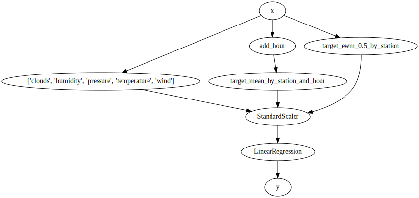

<div align="center">
  
</div>

<div align="center">
  <!-- Travis -->
  <a href="https://travis-ci.org/creme-ml/creme">
    
  </a>
  <!-- Codecov -->
  <a href="https://codecov.io/gh/creme-ml/creme">
    
  </a>
  <!-- Codacy -->
  <a href="https://www.codacy.com/app/MaxHalford/creme">
    
  </a>
  <!-- PyPI -->
  <a href="https://pypi.org/project/creme">
    
  </a>
  <!-- License -->
  <a href="https://opensource.org/licenses/BSD-3-Clause">
    
  </a>
</div>

<br/>

`creme` is a library for online machine learning, also known as in**creme**ntal learning. Online learning is a machine learning regime where a model learns one observation at a time. This is in contrast to batch learning where all the data is processed in one go. Incremental learning is desirable when the data is too big to fit in memory, or simply when it isn't available all at once. `creme`'s API is heavily inspired from that of [scikit-learn](https://scikit-learn.org/stable/), enough so that users who are familiar with it should feel right at home.

## Useful links

- [Documentation](https://creme-ml.github.io/)
  - [API reference](https://creme-ml.github.io/api.html)
  - [User guide](https://creme-ml.github.io/user-guide.html)
  - [FAQ](https://creme-ml.github.io/faq.html)
- [Issue tracker](https://github.com/creme-ml/creme/issues)
- [Package releases](https://pypi.org/project/creme/#history)
- [Change history](CHANGELOG.md)
- PyData Amsterdam 2019 presentation ([slides](https://maxhalford.github.io/slides/creme-pydata/), video incoming)
- [Blog post from pyimagesearch for image classification](https://www.pyimagesearch.com/2019/06/17/online-incremental-learning-with-keras-and-creme/)

## Installation

:point_up: `creme` is tested with Python 3.6 and above.

`creme` mostly relies on Python's standard library. Sometimes it relies on `numpy`, `scipy`, and `scikit-learn` so as not to reinvent the wheel. `creme` can simply be installed with `pip`.

```sh
pip install creme
```

## Quick example

In the following snippet we'll be training a linear regression to forecast the number of available bikes in bike stations from the city of Toulouse. We'll use the available numeric features, as well as calculate running averages of the target. Before being fed to the linear regression, the data will be scaled using a `StandardScaler`. Note that each of these steps works in a streaming fashion, including the feature extraction. We'll evaluate the model by asking it to forecast 30 minutes ahead and delaying the true answers, which ensures we're simulating a production scenario. Finally we will print the current score every 20,000 predictions.

```python
>>> import datetime as dt
>>> from creme import compose
>>> from creme import datasets
>>> from creme import feature_extraction
>>> from creme import linear_model
>>> from creme import metrics
>>> from creme import model_selection
>>> from creme import preprocessing
>>> from creme import stats

>>> X_y = datasets.fetch_bikes()

>>> def add_hour(x):
...     x['hour'] = x['moment'].hour
...     return x

>>> model = compose.Whitelister('clouds', 'humidity', 'pressure', 'temperature', 'wind')
>>> model += (
...     add_hour |
...     feature_extraction.TargetAgg(by=['station', 'hour'], how=stats.Mean())
... )
>>> model += feature_extraction.TargetAgg(by='station', how=stats.EWMean(0.5))
>>> model |= preprocessing.StandardScaler()
>>> model |= linear_model.LinearRegression()

>>> metric = metrics.MAE()

>>> model_selection.online_qa_score(
...     X_y=datasets.fetch_bikes(),
...     model=model,
...     metric=metrics.MAE(),
...     on='moment',
...     lag=dt.timedelta(minutes=30),
...     print_every=20_000
... )
[20,000] MAE: 13.743465
[40,000] MAE: 7.990616
[60,000] MAE: 6.101015
[80,000] MAE: 5.159895
[100,000] MAE: 4.593369
[120,000] MAE: 4.19251
[140,000] MAE: 3.904753
[160,000] MAE: 3.725466
[180,000] MAE: 3.568893
MAE: 3.555296

```

We can also draw the model to understand how the data flows through.

```python
>>> dot = model.draw()

```

<div align="center">
  
</div>


By only using a few lines of code, we've built a robust model and evaluated it by simulating a production scenario. You can find a more detailed version of this example [here](https://creme-ml.github.io/notebooks/bike-sharing-forecasting.html). `creme` is a framework that has a lot to offer, and as such we kindly refer you to the [documentation](https://creme-ml.github.io/) if you want to know more.

## Comparison with other solutions

- [scikit-learn](https://scikit-learn.org/stable/): [Some](https://scikit-learn.org/stable/modules/computing.html#incremental-learning) of it's estimators have a `partial_fit` method which allows them to update themselves with new observations. However, online learning isn't treated as a first class citizen, which can make things awkward. You should definitely use scikit-learn if your data fits in memory and that you can afford retraining your model from scratch every time new data is available.
- [Vowpal Wabbit](https://github.com/VowpalWabbit/vowpal_wabbit/wiki): VW is probably the fastest out-of-core learning system available. At it's core it implements a state-of-the-art adaptive gradient descent algorithm with many tricks. It also has some mechanisms for doing [active learning](https://www.wikiwand.com/en/Active_learning_(machine_learning)) and using [bandits](https://www.wikiwand.com/en/Multi-armed_bandit). However it isn't a "true" online learning system as it assumes the data is available in a file and can be looped over multiple times. Also it is somewhat difficult to [grok](https://www.wikiwand.com/en/Grok) for newcomers.
- [LIBOL](https://github.com/LIBOL/SOL): This is a good library written by academics with some great documentation. It's written in C++ and seems to be pretty fast. However it only focuses on the learning aspect of online learning, not on other mundane yet useful tasks such as feature extraction and preprocessing. Moreover it hasn't been updated for a few years.
- [Spark Streaming](https://spark.apache.org/docs/latest/streaming-programming-guide.html): This is an extension of [Apache Spark](https://www.wikiwand.com/en/Apache_Spark) which caters to big data practitioners. It processes data in mini-batches instead of actually doing real streaming operations. It also has some compatibility with the [MLlib](https://spark.apache.org/docs/latest/ml-guide.html) for implementing online learning algorithms, such as [streaming linear regression](https://spark.apache.org/docs/latest/mllib-linear-methods.html#streaming-linear-regression) and [streaming k-means](https://spark.apache.org/docs/latest/mllib-clustering.html#streaming-k-means). However it is a somewhat overwhelming solution which might be a bit overkill for certain use cases.
- [TensorFlow](https://www.wikiwand.com/en/TensorFlow): Deep learning systems are in some sense online learning systems because they use online gradient descent. However, popular libraries are mostly attuned to batch situations. Because frameworks such as [Keras](https://keras.io/) and [PyTorch](https://pytorch.org/) are so popular and very well backed, there is no real point in implementing neural networks in creme. Additionally, for a lot of problems neural networks might not be the right tool, and you might want to use a simple logistic regression or a decision tree (for which online algorithms exist).

Feel free to open an issue if you feel like other solutions are worth mentioning.

## Contributing

Like many subfields of machine learning, online learning is far from being an exact science and so there is still a lot to do. Feel free to contribute in any way you like, we're always open to new ideas and approaches. If you want to contribute to the code base please check out the [`CONTRIBUTING.md` file](`CONTRIBUTING.md`). Also take a look at the [issue tracker](https://github.com/creme-ml/creme/issues) and see if anything takes your fancy.

Last but not least you are more than welcome to share with us how you're using `creme` or online learning in general! We believe that online learning solves a lot of pain points in practice and we would love to share experiences.

This project follows the [all-contributors](https://github.com/all-contributors/all-contributors) specification. Contributions of any kind are welcome!

<!-- ALL-CONTRIBUTORS-LIST:START - Do not remove or modify this section -->
<!-- prettier-ignore -->
<table>
  <tr>
    <td align="center"><a href="https://maxhalford.github.io"><br /><sub><b>Max Halford</b></sub></a><br /><a href="#projectManagement-MaxHalford" title="Project Management">📆</a> <a href="https://github.com/Max Halford/creme/commits?author=MaxHalford" title="Code">💻</a></td>
    <td align="center"><a href="https://github.com/AdilZouitine"><br /><sub><b>AdilZouitine</b></sub></a><br /><a href="https://github.com/Max Halford/creme/commits?author=AdilZouitine" title="Code">💻</a></td>
    <td align="center"><a href="https://github.com/raphaelsty"><br /><sub><b>Raphael Sourty</b></sub></a><br /><a href="https://github.com/Max Halford/creme/commits?author=raphaelsty" title="Code">💻</a></td>
    <td align="center"><a href="http://www.linkedin.com/in/gbolmier"><br /><sub><b>Geoffrey Bolmier</b></sub></a><br /><a href="https://github.com/Max Halford/creme/commits?author=gbolmier" title="Code">💻</a></td>
    <td align="center"><a href="http://koaning.io"><br /><sub><b>vincent d warmerdam </b></sub></a><br /><a href="https://github.com/Max Halford/creme/commits?author=koaning" title="Code">💻</a></td>
    <td align="center"><a href="https://github.com/VaysseRobin"><br /><sub><b>VaysseRobin</b></sub></a><br /><a href="https://github.com/Max Halford/creme/commits?author=VaysseRobin" title="Code">💻</a></td>
    <td align="center"><a href="https://github.com/tweakyllama"><br /><sub><b>Lygon Bowen-West</b></sub></a><br /><a href="https://github.com/Max Halford/creme/commits?author=tweakyllama" title="Code">💻</a></td>
  </tr>
  <tr>
    <td align="center"><a href="https://github.com/flegac"><br /><sub><b>Florent Le Gac</b></sub></a><br /><a href="https://github.com/Max Halford/creme/commits?author=flegac" title="Code">💻</a></td>
    <td align="center"><a href="http://www.pyimagesearch.com"><br /><sub><b>Adrian Rosebrock</b></sub></a><br /><a href="#blog-jrosebr1" title="Blogposts">📝</a></td>
  </tr>
</table>

<!-- ALL-CONTRIBUTORS-LIST:END -->

## License

See the [license file](LICENSE).
