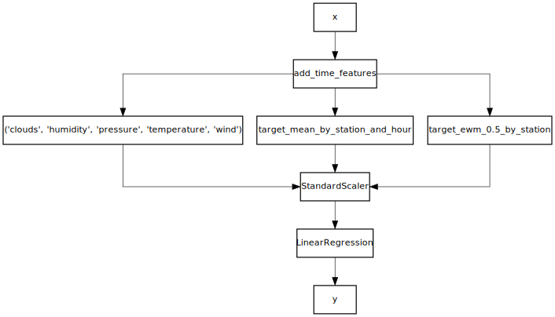

# Debugging a pipeline


```python
%matplotlib inline
```

`creme` encourages users to make use of pipelines. The biggest pain point of pipelines is that it can be hard to understand what's happening to the data, especially when the pipeline is complex. Fortunately the `Pipeline` class has a `debug_one` method that can help out.

Let's look at a fairly complex pipeline for predicting the number of bikes in 5 bike stations from the city of Toulouse. It doesn't matter if you understand the pipeline or not; the point of this notebook is to learn how to introspect a pipeline.


```python
import datetime as dt
from creme import compose
from creme import datasets
from creme import feature_extraction
from creme import linear_model
from creme import metrics
from creme import preprocessing
from creme import stats
from creme import stream


X_y = datasets.Bikes()
X_y = stream.simulate_qa(X_y, moment='moment', delay=dt.timedelta(minutes=30))

def add_time_features(x):
    return {
        **x,
        'hour': x['moment'].hour,
        'day': x['moment'].weekday()
    }

model = add_time_features
model |= (
    compose.Select('clouds', 'humidity', 'pressure', 'temperature', 'wind') +
    feature_extraction.TargetAgg(by=['station', 'hour'], how=stats.Mean()) +
    feature_extraction.TargetAgg(by='station', how=stats.EWMean())
)
model |= preprocessing.StandardScaler()
model |= linear_model.LinearRegression()

metric = metrics.MAE()

questions = {}

for i, x, y in X_y:
    # Question
    is_question = y is None
    if is_question:
        y_pred = model.predict_one(x)
        questions[i] = y_pred
    
    # Answer
    else:
        metric.update(y, questions[i])
        model = model.fit_one(x, y)
    
        if i >= 30000 and i % 30000 == 0:
            print(i, metric)
```

    30000 MAE: 2.193126
    60000 MAE: 2.249468
    90000 MAE: 2.288453
    120000 MAE: 2.265392
    150000 MAE: 2.267563
    180000 MAE: 2.282636


We can start by looking at what the pipeline looks by drawing it.


```python
model.draw()
```





As mentionned above the `Pipeline` class has a `debug_one` method. You can use this at any point you want to visualize what happen to an input `x`. For example, let's see what happens to the last seen `x`.


```python
model.debug_one(x)
```

    0. Input
    --------
    clouds: 88 (int)
    description: overcast clouds (str)
    humidity: 84 (int)
    moment: 2016-10-05 09:57:18 (datetime)
    pressure: 1,017.34000 (float)
    station: pomme (str)
    temperature: 17.45000 (float)
    wind: 1.95000 (float)
    
    1. add_time_features
    --------------------
    clouds: 88 (int)
    day: 2 (int)
    description: overcast clouds (str)
    hour: 9 (int)
    humidity: 84 (int)
    moment: 2016-10-05 09:57:18 (datetime)
    pressure: 1,017.34000 (float)
    station: pomme (str)
    temperature: 17.45000 (float)
    wind: 1.95000 (float)
    
    2. Transformer union
    --------------------
        2.0 ('clouds', 'humidity', 'pressure', 'temperature', 'wind')
        -------------------------------------------------------------
        clouds: 88 (int)
        humidity: 84 (int)
        pressure: 1,017.34000 (float)
        temperature: 17.45000 (float)
        wind: 1.95000 (float)
    
        2.1 target_mean_by_station_and_hour
        -----------------------------------
        target_mean_by_station_and_hour: 7.89396 (float)
    
        2.2 target_ewm_0.5_by_station
        -----------------------------
        target_ewm_0.5_by_station: 11.80372 (float)
    
    clouds: 88 (int)
    humidity: 84 (int)
    pressure: 1,017.34000 (float)
    target_ewm_0.5_by_station: 11.80372 (float)
    target_mean_by_station_and_hour: 7.89396 (float)
    temperature: 17.45000 (float)
    wind: 1.95000 (float)
    
    3. StandardScaler
    -----------------
    clouds: 1.54778 (float)
    humidity: 1.16365 (float)
    pressure: 0.04916 (float)
    target_ewm_0.5_by_station: 0.19214 (float)
    target_mean_by_station_and_hour: -0.26012 (float)
    temperature: -0.51938 (float)
    wind: -0.69426 (float)
    
    4. LinearRegression
    -------------------
    Name                              Value      Weight     Contribution  
                          Intercept    1.00000    9.86923        9.86923  
          target_ewm_0.5_by_station    0.19214    8.62895        1.65794  
                           humidity    1.16365    0.43660        0.50805  
                        temperature   -0.51938   -0.17480        0.09079  
                               wind   -0.69426   -0.12102        0.08402  
                             clouds    1.54778    0.03387        0.05242  
                           pressure    0.04916    0.23302        0.01146  
    target_mean_by_station_and_hour   -0.26012    0.18133       -0.04717  
    
    Prediction: 12.22675


The pipeline does quite a few things, but using `debug_one` shows what happens step by step. This is really useful for checking that the pipeline is behaving as you're expecting it too. Remember that you can `debug_one` whenever you wish, be it before, during, or after training a model.
