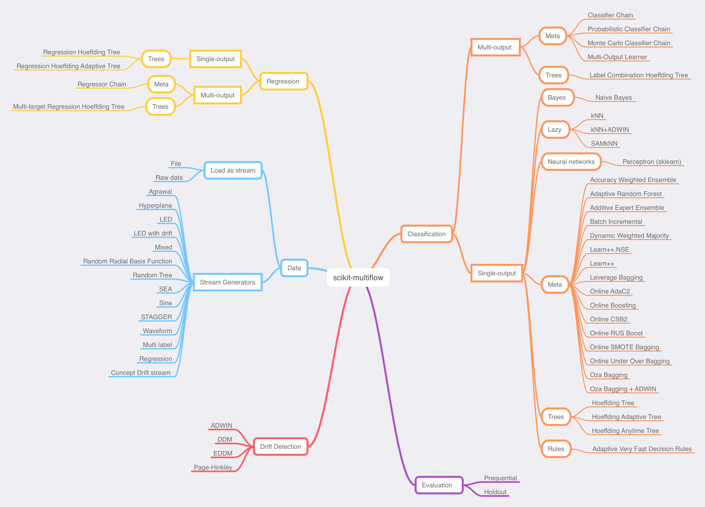

scikit-multiflow map
====================

The following map is provided to help users navigate the multiple methods available in ``scikit-multiflow``.
This is a rough guide to identify a method depending on the task/data at hand.

