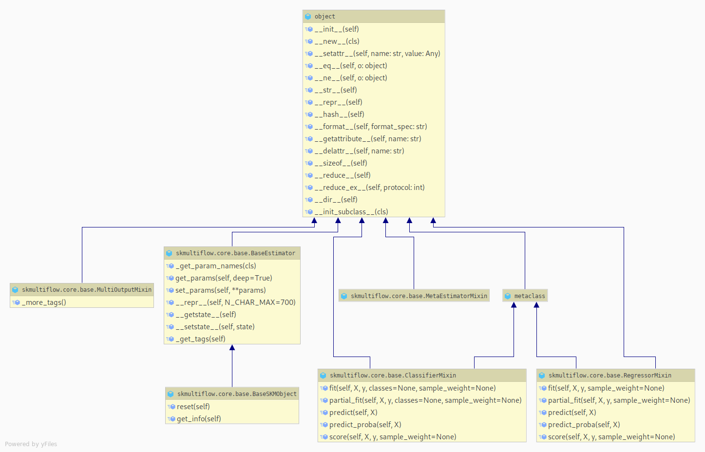
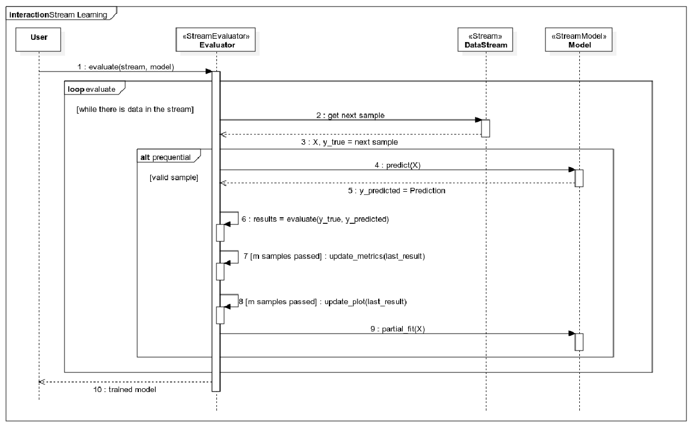

============
Architecture
============

There are three common components to learning problems: the **data** to learn from, the **learner** that creates a mathematical model from the data, and the **evaluation** where problem-specific metrics provide insights on the performance of a given model. These three components are available in ``scikit-multiflow`` and allow 1) to easily setup and run experiments 2) easily extend existing methods for research purposes.

The :class:`~skmultiflow.core.BaseSKMObject` class is the base class in ``scikit-multiflow``. It is based on ``sklearn.BaseEstimator`` in order to support inter-framework compatibility. It adds extra functionality relevant in the context of ``scikit-multiflow``.

Any stream model in ``scikit-multiflow`` is created by extending the :class:`~skmultiflow.core.BaseSKMObject` class and the corresponding task-specific mixin(s), such as: :class:`~skmultiflow.core.ClassifierMixin`, :class:`~skmultiflow.core.RegressorMixin`, :class:`~skmultiflow.core.MetaEstimatorMixin` and :class:`~skmultiflow.core.MultiOutputMixin`

The :class:`~skmultiflow.core.ClassifierMixin` defines the following methods:

* ``fit`` -- Trains a model in a batch fashion. Works as a an interface to batch methods that implement a ``fit()`` functions such as ``scikit-learn`` methods.
* ``partial_fit`` -- Incrementally trains a stream model.
* ``predict`` -- Predicts the target's value in supervised learning methods.
* ``predict_proba`` -- Calculates the probability of a sample pertaining to a given class in classification problems.

The :class:`~skmultiflow.core.RegressorMixin` defines the same methods for the regression setting with minor differences in the methods' signatures.

The following UML diagram provides an overview of the base classes in ``scikit-multiflow`` with their methods.

A stream model interacts with two other objects: a :class:`~skmultiflow.data.base_stream.Stream` object and (optionally) a :class:`~skmultiflow.evaluation.base_evaluator.StreamEvaluator` object. The ``Stream`` object provides a continuous flow of data on request. The ``StreamEvaluator`` performs multiple tasks: query the stream for data, train and test the model on the incoming data and continuously tracks the model's performance.

Following, is the sequence to train a stream model and track performance in ``scikit-multiflow`` using the ``Prequential`` evaluator.

**Note:** The ``StreamModel`` class described in the original paper of ``scikit-multiflow`` has been replaced in version 0.3.0. The same functionality is now achieved by the above described combination of :class:`~skmultiflow.core.BaseSKMObject` + the corresponding mixin.