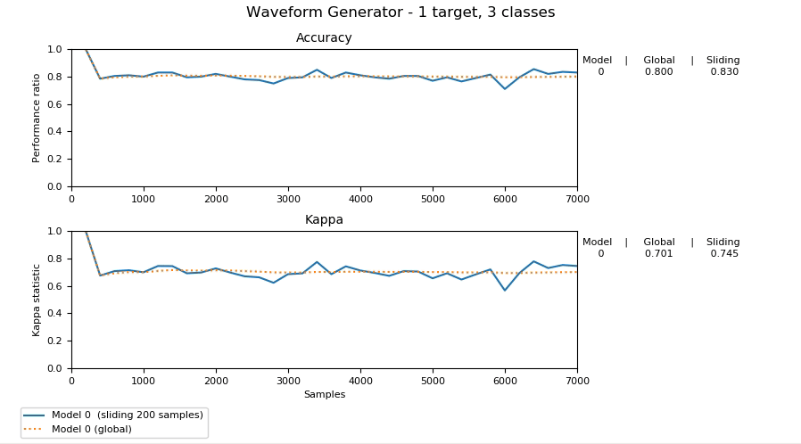

=================
Quick-Start Guide
=================

Train and test a stream classification model in ``scikit-multiflow``
====================================================================

.. py:currentmodule:: skmultiflow.trees

In this example, we will use a data stream to train a :class:`HoeffdingTreeClassifier` and will
measure its performance using prequential evaluation:

.. py:currentmodule:: skmultiflow.data

1. Create a stream

   The :class:`WaveformGenerator` generates by default samples with 21 numeric attributes and 3
   target_values, based on a random differentiation of some base waveforms:

   .. code-block:: python

      >>> stream = WaveformGenerator()

2. Instantiate the Hoeffding Tree classifier

   We will use the default parameters.

   .. code-block:: python

      >>> ht = HoeffdingTreeClassifier()

.. py:currentmodule:: skmultiflow.evaluation

3. Setup the evaluator, we will use the :class:`EvaluatePrequential` class.

   .. code-block:: python

      >>> evaluator = EvaluatePrequential(show_plot=True,
      >>>                                 pretrain_size=200,
      >>>                                 max_samples=20000)

   * ``show_plot=True`` to get a dynamic plot that is updated as the classifier is trained.
   * ``pretrain_size=200`` sets the number of samples passed in the first train call.
   * ``max_sample=20000`` sets the maximum number of samples to use.

4. Run the evaluation

   By calling ``evaluate()``, we pass control to the *evaluator*, which will perform the following
   sub-tasks:

   * Check if there are samples in the stream
   * Pass the next sample to the classifier:
      - test the classifier (using ``predict()``)
      - update the classifier (using ``partial_fit()``)
   * Update the evaluation results and plot

   .. code-block:: python

      evaluator.evaluate(stream=stream, model=ht)

**Putting it all together:**

.. code-block:: python
   :linenos:

   >>> from skmultiflow.data import WaveformGenerator
   >>> from skmultiflow.trees import HoeffdingTreeClassifier
   >>> from skmultiflow.evaluation import EvaluatePrequential
   >>>
   >>> # 1. Create a stream
   >>> stream = WaveformGenerator()
   >>>
   >>> # 2. Instantiate the HoeffdingTreeClassifier
   >>> ht = HoeffdingTreeClassifier()
   >>>
   >>> # 3. Setup the evaluator
   >>> evaluator = EvaluatePrequential(show_plot=True,
   >>>                                 pretrain_size=200,
   >>>                                 max_samples=20000)
   >>>
   >>> # 4. Run evaluation
   >>> evaluator.evaluate(stream=stream, model=ht)

**Note:** Since we set `show_plot=True`, a new window will be created for the plot:

Load data from a file as a stream and save test results into a file.
====================================================================

.. py:currentmodule:: skmultiflow.trees

There are cases where we want to use data stored in files. In this example we will train a
:class:`HoeffdingTreeClassifier`, but this time we will read the data from a (csv) file and will
write the results of the evaluation into a (csv) file.

.. py:currentmodule:: skmultiflow.data

1. Load the data set as a stream

   For this purpose we will use the :class:`FileStream` class:

   .. code-block:: python

      >>> stream = FileStream(filepath)

   * ``filepath``. A string indicating the path where the data file is located.

   The ``FileStream`` class will generate a stream using the data contained in the file.

2. Instantiate the Hoeffding Tree classifier

   We will use the default parameters.

   .. code-block:: python

      >>> ht = HoeffdingTreeClassifier()

.. py:currentmodule:: skmultiflow.evaluation

3. Setup the evaluator, we will use the :class:`EvaluatePrequential` class.

   .. code-block:: python

      >>> evaluator = EvaluatePrequential(pretrain_size=1000,
      >>>                                 max_samples=10000,
      >>>                                 output_file='results.csv')

   * ``pretrain_size=1000`` sets the number of samples passed in the first train call.
   * ``max_samples=100000`` sets the maximum number of samples to use.
   * ``output_file='results.csv'`` indicates that the results should be stored into a file.
     In this case a file *results.csv* will be created in the current path.

4. Run the evaluation

   By calling ``evaluate()``, we pass control to the *evaluator*, which will perform the following
   sub-tasks:

   * Check if there are samples in the stream
   * Pass the next sample to the classifier:
     - test the classifier (using `predict()`)
     - update the classifier (using `partial_fit()`)
   * Write results to `output_file`

   When the test finishes, the `results.csv` file will be available in the current path.

The file contains information related to the test that generated the file. For this example::

   # TEST CONFIGURATION BEGIN
   # File Stream: filename: elec.csv  -  n_targets: 1
   # [0] HoeffdingTreeClassifier: max_byte_size: 33554432 - memory_estimate_period: 1000000 - grace_period: 200 - split_criterion: info_gain - split_confidence: 1e-07 - tie_threshold: 0.05 - binary_split: False - stop_mem_management: False - remove_poor_atts: False - no_pre_prune: False - leaf_prediction: nba - nb_threshold: 0 - nominal_attributes: [] -
   # Prequential Evaluator: n_wait: 200 - max_samples: 10000 - max_time: inf - output_file: results.csv - batch_size: 1 - pretrain_size: 1000 - task_type: classification - show_plot: False - metrics: ['performance', 'kappa']
   # TEST CONFIGURATION END

And data related to performance during the evaluation:

* ``id``: the id of the sample that was used for testing
* ``global_performance``: overall performance (accuracy)
* ``sliding_performance``: sliding window performance (accuracy)
* ``global_kappa``: overall kappa statistics
* ``sliding_kappa``: sliding window kappa statistics

**Putting it all together:**

.. code-block:: python
   :linenos:

   >>> from skmultiflow.data import FileStream
   >>> from skmultiflow.trees import HoeffdingTreeClassifier
   >>> from skmultiflow.evaluation import EvaluatePrequential
   >>>
   >>> # 1. Create a stream
   >>> stream = FileStream("https://raw.githubusercontent.com/scikit-multiflow/"
   >>>                     "streaming-datasets/master/elec.csv")
   >>>
   >>> # 2. Instantiate the HoeffdingTreeClassifier
   >>> ht = HoeffdingTreeClassifier()
   >>>
   >>> # 3. Setup the evaluator
   >>> evaluator = EvaluatePrequential(pretrain_size=1000,
   >>>                                 max_samples=10000,
   >>>                                 output_file='results.csv')
   >>>
   >>> # 4. Run evaluation
   >>> evaluator.evaluate(stream=stream, model=ht)

**Note:** The ``elec.csv`` file is available in the following repository:
https://github.com/scikit-multiflow/streaming-datasets

To avoid downloading the data multiple times, you can keep a local copy and
replace the path accordingly.
